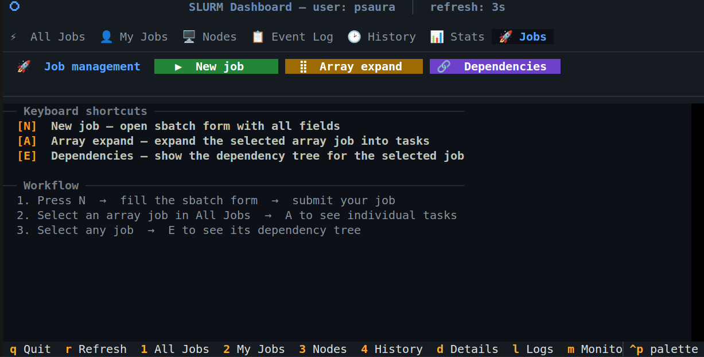

# Slurm Dashboard

A fast, terminal-based user interface (TUI) for monitoring and managing Slurm jobs. 

Running `squeue`, `sacct`, and `tail -f` repeatedly can get tedious. This dashboard provides a centralized, interactive view of your HPC jobs directly from your SSH session, without requiring X11 forwarding, web servers, or complex setups.



## Features

- **Live Queue Monitoring:** Watch your jobs progress in real-time. 
- **Integrated Log Viewer:** Read `stdout` and `stderr` directly in the UI. Auto-resolves Slurm patterns (like `%j` and `%J`) and supports live tailing.
- **History & Analytics:** Keeps track of your past jobs, displaying success rates, average execution times, and wall-time usage.
- **Array Job Support:** Expand array jobs to inspect individual task statuses and exit codes.
- **Dependency Trees:** Visually trace job dependencies (`afterok`, `afterany`, etc.) to understand why a job is pending.
- **Quick Actions:** Hold, release, cancel, or resubmit jobs with a single keystroke.

## Requirements

- Python 3.9+
- `textual` (Python library for the TUI)
- Access to a Slurm cluster (`squeue`, `sacct`, `scontrol`, `sstat`)

## Installation

1. Clone the repository:
   ```bash
   git clone https://github.com/yourusername/slurm-dashboard.git
   cd slurm-dashboard
   ```

2. Install the required dependencies:
   ```bash
   cd src && sh install.sh && source ~/.bashrc
   ```
   *(Note: Depending on your cluster environment, you might want to install this in a virtual environment or use `pip install --user textual rich`).*

## Usage

Simply run the Python script from your terminal:

```bash
sqdash
```
or
```bash
python src/slurm_dashboard.py
```

### Keyboard Shortcuts

The UI is heavily keyboard-driven. Most panels have a footer indicating available shortcuts, but here are the global ones:

| Key | Action |
| :--- | :--- |
| `1`-`6` | Switch between main tabs (All Jobs, My Jobs, Nodes, History, Stats) |
| `n` | Submit a new job (opens sbatch form) |
| `l` | View logs for the selected job |
| `m` | Open node monitor (CPU/Mem usage) |
| `a` | Expand array job tasks |
| `e` | Show dependency tree for the selected job |
| `r` | Manual refresh |
| `c` | Cancel selected job |
| `b` | Resubmit job |
| `h` / `u` | Hold / Unhold job |
| `Esc` / `q` | Close current modal / Quit application |

## How it works

The dashboard runs entirely in user-space. It acts as a wrapper around standard Slurm binaries. 
- Live data is fetched using `squeue` and `sinfo`.
- Historical data relies on `sacct`.
- Resource monitoring uses `sstat` for running jobs and SSH for raw node metrics.
- Internal state (history caches) is saved to `~/.slurm_dashboard_events.log` and a local JSON cache to keep load times fast without spamming the Slurm controller.

## Contributing

Pull requests are welcome. For major changes, please open an issue first to discuss what you would like to change.

## License

[MIT](LICENSE)