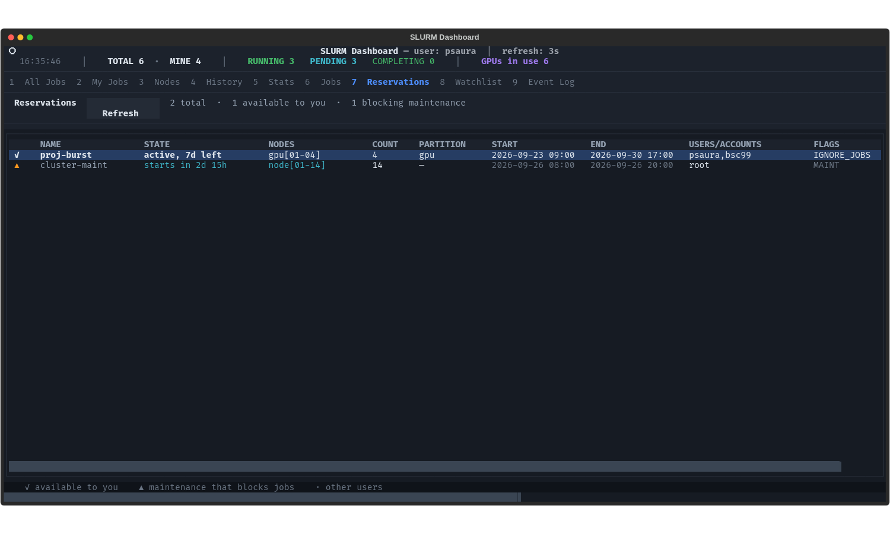
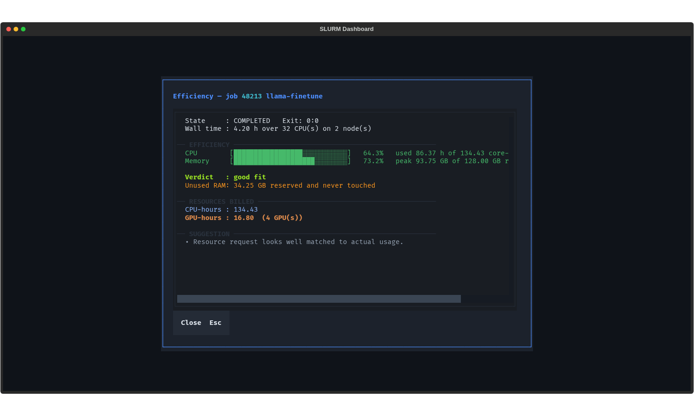

# Slurm Dashboard

A fast, terminal-based user interface (TUI) for monitoring and managing Slurm jobs. 

Running `squeue`, `sacct`, and `tail -f` repeatedly can get tedious. This dashboard provides a centralized, interactive view of your HPC jobs directly from your SSH session, without requiring X11 forwarding, web servers, or complex setups.


| Reservations | Efficiency report |
| :--- | :--- |
|  |  |

## Features

- **Live Queue Monitoring:** Watch your jobs progress in real-time. 
- **Integrated Log Viewer:** Read `stdout` and `stderr` directly in the UI. Auto-resolves Slurm patterns (like `%j` and `%J`) and live-tails the file every 5 s while the job is active.
- **History & Analytics:** Keeps track of your past jobs, displaying success rates, average execution times, and wall-time usage.
- **Array Job Support:** Expand array jobs to inspect individual task statuses and exit codes.
- **Dependency Trees:** Visually trace job dependencies (`afterok`, `afterany`, etc.) to understand why a job is pending.
- **Quick Actions:** Hold, release, cancel, or resubmit jobs with a single keystroke.
- **Efficiency Reports:** `seff`-style CPU and memory efficiency per job, plus an aggregate view over your history that shows how many core-hours you reserved and never used.
- **Why Is My Job Pending:** Blocking reason in plain language, queue position, `sprio` priority breakdown, and your fairshare.
- **Submit Templates:** Save an sbatch form as a named template and reload it next time. Partition limits are shown as you type.
- **Rerun Failed Array Tasks:** Expand an array job and resubmit only the tasks that failed, as a compact `--array=1,3-5` selection.
- **Log Search:** Filter the log viewer by text or `/regex/`, or show only error and warning lines. Live logs are tailed incrementally.
- **Bulk Cancel:** Cancel many of your jobs at once behind a typed confirmation.
- **Completion Alerts:** Terminal bell, toast, and an optional hook script when one of your jobs finishes.
- **Works Without SSH:** Node metrics come from `scontrol`; SSH to compute nodes is optional and can be turned off entirely.
- **Reservations:** See who has the cluster booked, which reservations *you* may submit into, and which maintenance windows are blocking your jobs.
- **Watchlist:** Pin the jobs you care about. They stay on their own tab across restarts, with live state, and are marked with a ★ in the queue.
- **History From Day One:** On first run the dashboard imports your recent jobs from `sacct`, so History, Stats and the efficiency reports are useful immediately instead of after weeks of watching.
- **Node Co-Tenants:** The monitor shows which other jobs share your node — usually the reason a job runs slower than it should.

## Requirements

- Python 3.9+
- `textual` (Python library for the TUI)
- Access to a Slurm cluster (`squeue`, `sacct`, `scontrol`, `sstat`)

## Installation

1. Clone the repository:
   ```bash
   git clone https://github.com/yourusername/slurm-dashboard.git
   cd slurm-dashboard
   ```

2. Install the required dependencies:
   ```bash
   cd src && sh install.sh && source ~/.bashrc
   ```
   *(Note: Depending on your cluster environment, you might want to install this in a virtual environment or use `pip install --user textual rich`).*

## Usage

Simply run the Python script from your terminal:

```bash
sqdash
```
or
```bash
python src/slurm_dashboard.py
```

### Keyboard Shortcuts

The UI is heavily keyboard-driven. Most panels have a footer indicating available shortcuts, but here are the global ones:

| Key | Action |
| :--- | :--- |
| `1`-`8` | Switch between main tabs (All Jobs, My Jobs, Nodes, History, Stats, Jobs, Reservations, Watchlist) |
| `n` | Submit a new job (opens sbatch form) |
| `l` | View logs for the selected job |
| `m` | Open node monitor (CPU/Mem usage) |
| `a` | Expand array job tasks |
| `e` | Show dependency tree for the selected job |
| `r` | Manual refresh |
| `c` | Cancel selected job |
| `b` | Resubmit job |
| `h` / `u` | Hold / Unhold job |
| `f` | Efficiency report for the selected job |
| `w` | Why is this job pending? |
| `k` | Bulk cancel your jobs |
| `p` | Pin / unpin the selected job (Watchlist) |
| `Esc` / `q` | Close current modal / Quit application |

Inside the log viewer: `/` focuses the filter box (plain text, or `/regex/`),
and the **Errors only** button hides everything that is not an error or warning.

Tables adapt to the terminal width: below 140 columns some columns are hidden,
and below 90 columns only the essentials remain. Actions keep working at any
width.

## How it works

The dashboard runs entirely in user-space. It acts as a wrapper around standard Slurm binaries. 
- Live data is fetched using `squeue` and `sinfo`.
- Historical data relies on `sacct`, queried only for jobs the dashboard already tracks.
- Resource monitoring uses `sstat` for running jobs and SSH for raw node metrics.
- Internal state (history caches) is saved to `~/.slurm_dashboard_events.log` and a local JSON cache to keep load times fast without spamming the Slurm controller.

### Local state

| File | Contents |
| :--- | :--- |
| `~/.slurm_dashboard_history.json` | Your tracked jobs, their final states and resolved log paths |
| `~/.slurm_dashboard_events.log` | Rolling event log of observed job state changes |
| `~/.config/slurm_dashboard/config.ini` | Settings (see below) |
| `~/.config/slurm_dashboard/templates.json` | Saved sbatch templates |
| `~/.config/slurm_dashboard/watchlist.json` | Pinned jobs |

## Theme

The interface uses a single design-token table (`PALETTE` in the source) that
feeds both the Textual stylesheets, as `$sq-*` variables, and the Rich styles
used to paint table cells. Nothing in the UI names a colour directly.

The rules it follows:

- **Neutral chrome, meaningful colour.** Surfaces are a cool graphite ramp.
  Hue is reserved for job state and utilisation thresholds, so a red cell
  always means something is wrong.
- **One accent.** Azure marks focus, selection and the single primary action
  in each context. Other buttons stay quiet; destructive ones only fill with
  red on hover.
- **Emphasis by weight.** Your own jobs are bold rather than tinted, which
  keeps the state colours legible.
- **Single-width glyphs only.** Emoji occupy two cells and misalign every
  column after them, so the UI uses typographic marks (`★`, `✓`, `▲`, `·`).

`tests/test_theme.py` enforces this: it fails if a colour appears outside the
palette, if a stylesheet hardcodes a hex value, if a theme variable is
undefined or unused, or if a double-width glyph creeps in.

To restyle the dashboard, edit `PALETTE` — every surface, border and state
colour follows from it.

The theme tests also check contrast: text tokens must clear 4.5:1 against
every surface, state colours 3:1, and structural tokens (borders, surfaces)
are rejected outright if used to draw text. That last rule exists because
section headings were once styled with the hairline colour at 1.32:1, which
made them invisible.

## Configuration

The config file is created on first run. Write it explicitly with:

```bash
sqdash --write-config     # create it with documented defaults
sqdash --show-config      # print the effective settings
```

```ini
[general]
refresh_interval = 3      # seconds between squeue polls
max_history = 500
history_only_mine = true
seed_history_days = 30    # import your last N days from sacct at startup (0 = off)

[monitor]
use_ssh = true            # false = read node usage from scontrol only
refresh_interval = 8
max_nodes = 8

[logs]
live_refresh = 5

[notifications]
bell_on_finish = true
notify_on_finish = true
hook =                    # executable called as: hook <jobid> <state> <name>
```

**If your site does not allow SSH to compute nodes, set `use_ssh = false`.**
The monitor then reports allocation and load from `scontrol show node`, which
always works. With SSH enabled it additionally shows live `nvidia-smi` and
`/proc` figures on top.

The completion hook receives three arguments and runs in the background:

```bash
#!/usr/bin/env bash
# ~/bin/job-done.sh  (chmod +x, then set hook = ~/bin/job-done.sh)
notify-send "Slurm job $1 finished: $2 ($3)"
```

## Development

```bash
pip install pytest
python -m pytest          # 189 tests, no Slurm installation required
```

Tests fake every Slurm command and drive the real TUI headlessly, so they run
anywhere. `$HOME` and `$XDG_CONFIG_HOME` are redirected to a temporary
directory, so running them never touches your own history or config.

**Run the suite on Python 3.9 before releasing.** Login nodes often ship 3.9
while development happens on a newer interpreter, and some incompatibilities
(a PEP 604 `X | None` union outside an annotation, for example) only fail
there. `tests/test_compat.py` catches the common cases statically on any
version, but a real 3.9 run is the real check:

```bash
uv venv --python 3.9 .venv39 && uv pip install --python .venv39/bin/python textual rich pytest
.venv39/bin/python -m pytest
```

Both files are created with mode `0600`, since they record job names, working
directories and log paths. The history file only tracks **your own** jobs
(`HISTORY_ONLY_MINE` in the script) — it is capped at 500 entries, so recording
every job on the cluster would evict your own within minutes on a busy system.

## Security notes

- The dashboard never runs a shell on your input: every Slurm command is
  executed as an argument vector, and job ids and node names are validated
  before they are passed to `scancel`, `scontrol`, `sstat` or `ssh`.
- Resubmission (`b`) only accepts a recovered `SubmitLine` that is an actual
  `sbatch` invocation. Anything else is reported rather than executed.
- Node metrics use `ssh -o StrictHostKeyChecking=accept-new -o BatchMode=yes`:
  a first-time host is trusted, but a host whose key *changed* is refused.
  Passwordless key auth to the compute nodes is required; no password is read.
- Hold / release / cancel are refused unless the selected job is owned by
  `$USER`. This is a convenience guard — Slurm itself remains the authority.

## Contributing

Pull requests are welcome. For major changes, please open an issue first to discuss what you would like to change.

## License

[MIT](LICENSE)